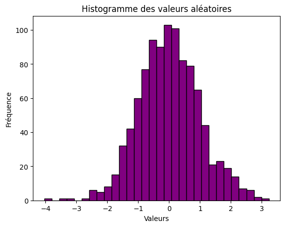
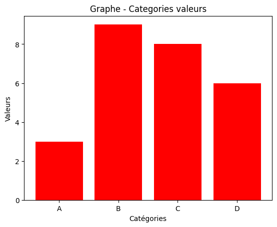

# Institut Universitaire des Sciences

### Devoir 1 - Math Info
### Prepare par :

### Nom : PIERRE
### Prenom : Yann Lelay
### Niveau : III - Sces Informatiques

---


1 - Installer Jupyter Notebook


2- Écris un programme qui convertit un nombre décimal en hexadécimal en demandant à l'utilisateur de
saisir ce nombre.


```python
decimal = int(input("Entrer un nombre decimal : "))
hexad = hex(decimal)
print(f"{decimal} en hexadécimal est {hexad[2:].upper()}")
```

    Entrer un nombre decimal :  45
    

    45 en hexadécimal est 2D
    

3- Écris un programme qui convertit un nombre hexadécimal en décimal en demandant à l'utilisateur de
saisir ce nombre.


```python
hexad = input("Veuillez entrer un nombre hexadecimal : ")
decimal = int(hexad, 16)
print(f"{hexad} en décimal est {decimal}")

```

    Veuillez entrer un nombre hexadecimal :  56
    

    56 en décimal est 86
    

4- Créer un fichier CSV dans Python, charger le et l'afficher


```python
import pandas as pd

data = {
"Prenom": ["Peter", "Ismael", "Web", "Badio", "Evens"],
"Nom": ["Chery", "St-Amour", "Marcelin", "Robaldo", "Elisee"]
}

df = pd.DataFrame(data)

df.to_csv("Inscrits.csv", index=False)
print("Fichier CSV créé avec succès !")
```

    Fichier CSV créé avec succès !
    


```python
df = pd.read_csv("Inscrits.csv")
print(df.head())

```

       Prenom       Nom
    0   Peter     Chery
    1  Ismael  St-Amour
    2     Web  Marcelin
    3   Badio   Robaldo
    4   Evens    Elisee
    

5- . Créer grande base de données (5000+ lignes) aléatoires


```python
import pandas as pd
import numpy as np
from faker import Faker
fake = Faker() # Générateur de données aléatoires
# Nombre de lignes à générer
n = 5000
# Générer des données aléatoires
data = {
'ID': np.arange(1, n+1), # ID de 1 à 1000
'Nom': [fake.name() for _ in range(n)], # Noms aléatoires
'Âge': np.random.randint(18, 60, size=n), # Âge entre 18 et 60 ans
'Ville': [fake.city() for _ in range(n)], # Villes aléatoires
'Email': [fake.email() for _ in range(n)], # Emails aléatoires
'Date Inscription': [fake.date_this_decade() for _ in range(n)] # Dates d'inscription
}
# Convertir en DataFrame Pandas
df = pd.DataFrame(data)
# Enregistrer dans un fichier Excel
df.to_excel('grande_base_de_donnees.xlsx', index=False, engine='openpyxl')
print("Fichier Excel de 5000 entrées généré avec succès !")

```

    Fichier Excel de 5000 entrées généré avec succès !
    

 6- Créer 3Graphes 


```python
import numpy as np
import matplotlib.pyplot as plt
# Générer des données aléatoires
data = np.random.randn(1000)
# Créer l'histogramme
plt.hist(data, bins=30, color='purple', edgecolor='black')
# Ajouter des titres
plt.xlabel("Valeurs")
plt.ylabel("Fréquence")
plt.title("Histogramme des valeurs aléatoires")
# Afficher le graphe
plt.show()
```


    

    


```python
import matplotlib.pyplot as plt
# Données
categories = ["A", "B", "C", "D"]
valeurs = [3, 9, 8, 6]


# Créer le graphique en barres
plt.bar(categories, valeurs, color='red')
# Ajouter des titres
plt.xlabel("Catégories")
plt.ylabel("Valeurs")
plt.title("Graphe - Categories valeurs")

plt.show
```


    <function matplotlib.pyplot.show(close=None, block=None)>


    

    


```python
import matplotlib.pyplot as plt

# Données
labels = ["Apple", "Samsung", "Huawei", "Xiaomi"]
parts = [40, 30, 15, 15]
# Créer un diagramme circulaire
plt.pie(parts, labels=labels, autopct='%1.1f%%', colors=['red', 'blue', 'green', 'orange'])
# Ajouter un titre
plt.title("Part de marché des smartphones")
# Afficher le graphe
plt.show()
```


    

    


## Conclusion

Ce Td m'aide dans l'utilisation de nouveau moyen technologique et augmente mes compétences en programmation mathematique avec Python en  faisant des conversion decimal en hexadecimal et vice-versa, creation de schema avec la librairie matplotlib. 
